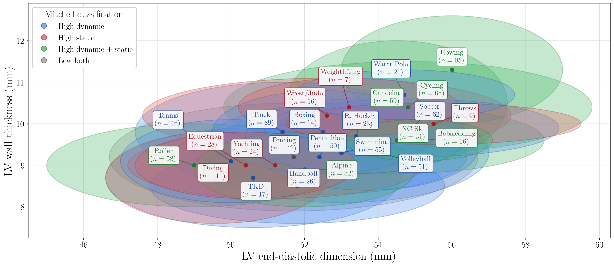
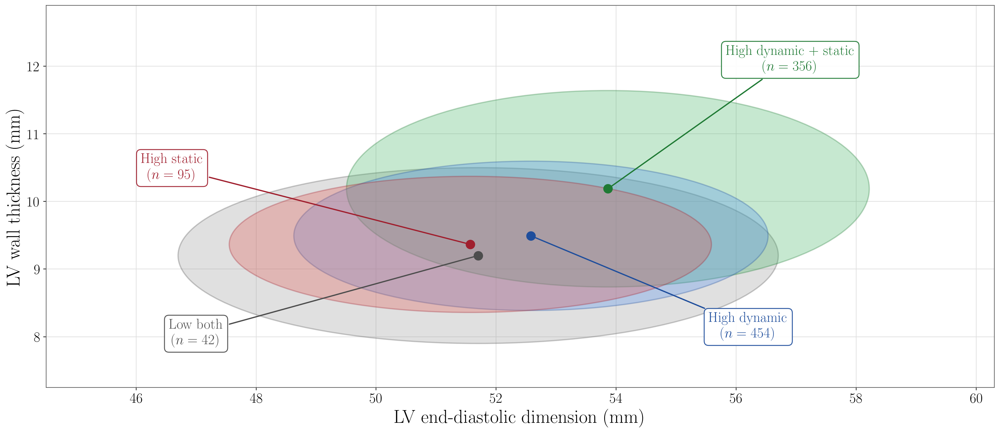

# Athlete's Heart: Cardiac Remodeling by Sport

Visualization and analysis of left-ventricular (LV) remodeling across 25 sports,
colored by the **Mitchell / Task Force 8 classification** of exercise (the
static vs. dynamic demand of each sport).

**Data source:** Spirito P, Pelliccia A, Proschan MA, *et al.* "Morphology of the
'athlete's heart' assessed by echocardiography in 947 elite athletes representing
27 sports." *Am J Cardiol* 1994;74(8):802–806
([doi:10.1016/0002-9149(94)90439-1](https://doi.org/10.1016/0002-9149(94)90439-1)).
Per-sport mean ± SD and athlete counts are taken from Table I. The paper's two
cycling rows (endurance + sprint) and two track rows (long-distance + sprint) are
each merged into one, giving 25 sports whose counts still sum to 947.

## Figure



Each ellipse is one sport, centered on its mean LV end-diastolic dimension
(LVEDd) and wall thickness, with half-axes of ±1 SD. Fill color encodes the
Mitchell class: **green** = high dynamic + static, **blue** = high dynamic,
**red** = high static, **gray** = low both.

```
python sport_heart_ellipses.py      # writes sport_heart_ellipses.pdf and .png
```

Requires `numpy`, `matplotlib`, and a working LaTeX installation (labels are
typeset with LaTeX). Labels are placed with a small force-based de-overlap pass.

## Does heart shape track with exercise type?

```
python analyze_trends.py
```

Only per-sport summary statistics are public, so category-level statistics are
pooled *exactly* from each sport's (n, mean, SD) — the within-category variance
combines within-sport and between-sport spread of the individual athletes.

| Mitchell category            | Sports | n   | LVEDd (mm)     | Wall thickness (mm) |
|------------------------------|:------:|:---:|:--------------:|:-------------------:|
| High dynamic + static (green)|   7    | 356 | 53.9 ± 4.4     | 10.2 ± 1.5          |
| High dynamic (blue)          |  11    | 454 | 52.6 ± 4.0     | 9.5 ± 1.1           |
| High static (red)            |   6    | 95  | 51.6 ± 4.0     | 9.4 ± 1.0           |
| Low both (gray, fencing only)|   1    | 42  | 51.7 ± 5.0     | 9.2 ± 1.3           |

One-way ANOVA across the four categories is significant for both dimensions:
LVEDd `F(3,943) = 11.6, p ≈ 2e-7`; wall thickness `F(3,943) = 26.8, p ≈ 1e-16`.



Summary of the per-sport figure on the same axes: one **±1 SD ellipse per
exercise class** (athlete-weighted mean, pooled SD), labeled by exercise form
and athlete count (`python plot_trends.py`). The high-dynamic + static class
sits up and to the right — larger cavity *and* thicker wall.

**Trends:**

- **High dynamic + static sports (rowing, cycling, canoeing, cross-country
  skiing…) remodel the most on *both* axes.** They have both the largest cavity
  and the thickest wall, and are significantly greater than every other category
  (all pairwise `p < 0.01`; wall-thickness effect sizes Cohen's *d* = 0.5–0.7).
- **A clean "static → thick wall / dynamic → big cavity" split is *not* seen
  here.** High-static sports do not show disproportionately thick walls: on wall
  thickness the high-dynamic, high-static, and low-both groups are statistically
  indistinguishable (pairwise `p > 0.15`). This matches the original paper's
  conclusion that isometric athletes' absolute wall thickness stays within normal
  limits.
- **Cavity size and wall thickness grow together**, not as a trade-off:
  athlete-weighted correlation across the 25 sports is `r = 0.79`. The dominant
  axis of variation is overall (balanced) remodeling, largely tracking the
  endurance/volume load of the sport rather than a static-vs-dynamic dichotomy.

**Caveats:** classifications are the color assignments used in this repo; "low
both" is a single sport (fencing); tests use pooled summary statistics rather
than individual-level data; and associations are observational, not causal.

## Files

| File | Purpose |
|------|---------|
| [`sport_heart_ellipses.py`](sport_heart_ellipses.py) | Builds the ellipse figure (PDF + PNG) |
| [`analyze_trends.py`](analyze_trends.py) | Category statistics, ANOVA, and pairwise tests |
| [`plot_trends.py`](plot_trends.py) | Summary figure: one ±1 SD ellipse per exercise class, same axes |
| `sport_heart_ellipses.pdf` / `.png` | Generated per-sport ellipse figure |
| `trends_by_classification.pdf` / `.png` | Generated summary figure |
