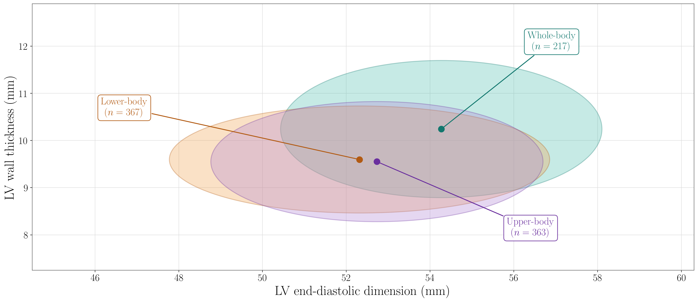
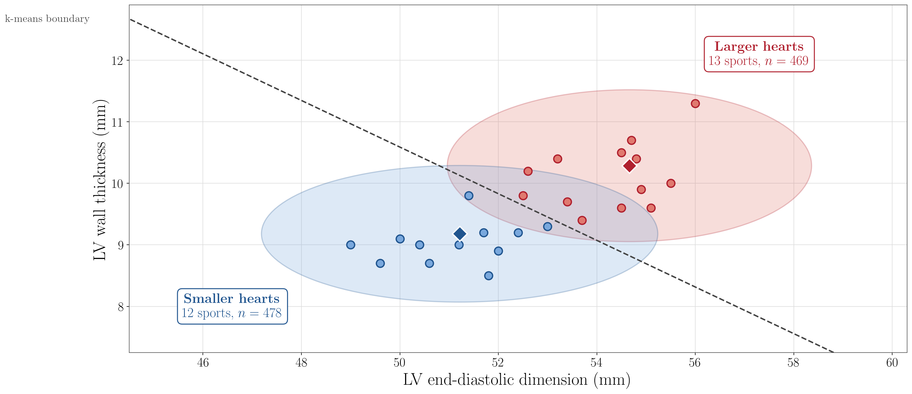

# Athlete's Heart: Cardiac Remodeling by Sport

Visualization and analysis of left-ventricular (LV) remodeling across 25 sports,
colored by the **Mitchell / Task Force 8 classification** of exercise (the
static vs. dynamic demand of each sport).

**Data source:** Spirito P, Pelliccia A, Proschan MA, *et al.* "Morphology of the
'athlete's heart' assessed by echocardiography in 947 elite athletes representing
27 sports." *Am J Cardiol* 1994;74(8):802–806
([doi:10.1016/0002-9149(94)90439-1](https://doi.org/10.1016/0002-9149(94)90439-1)).
Per-sport mean ± SD and athlete counts are taken from Table I. The paper's two
cycling rows (endurance + sprint) and two track rows (long-distance + sprint) are
each merged into one, giving 25 sports whose counts still sum to 947.

## Figure


Each ellipse is one sport, centered on its mean LV end-diastolic dimension
(LVEDd) and wall thickness, with half-axes of ±1 SD. Fill color encodes the
Mitchell class: **green** = high dynamic + static, **blue** = high dynamic,
**red** = high static, **gray** = low both.

```
python sport_heart_ellipses.py      # writes sport_heart_ellipses.pdf and .png
```

Requires `numpy`, `matplotlib`, and a working LaTeX installation (labels are
typeset with LaTeX). Labels are placed with a small force-based de-overlap pass.

## Does heart shape track with exercise type?

```
python analyze_trends.py
```

Only per-sport summary statistics are public, so category-level statistics are
pooled *exactly* from each sport's (n, mean, SD) — the within-category variance
combines within-sport and between-sport spread of the individual athletes.

| Mitchell category            | Sports | n   | LVEDd (mm)     | Wall thickness (mm) |
|------------------------------|:------:|:---:|:--------------:|:-------------------:|
| High dynamic + static (green)|   7    | 356 | 53.9 ± 4.4     | 10.2 ± 1.5          |
| High dynamic (blue)          |  11    | 454 | 52.6 ± 4.0     | 9.5 ± 1.1           |
| High static (red)            |   6    | 95  | 51.6 ± 4.0     | 9.4 ± 1.0           |
| Low both (gray, fencing only)|   1    | 42  | 51.7 ± 5.0     | 9.2 ± 1.3           |

One-way ANOVA across the four categories is significant for both dimensions:
LVEDd `F(3,943) = 11.6, p ≈ 2e-7`; wall thickness `F(3,943) = 26.8, p ≈ 1e-16`.


Summary of the per-sport figure on the same axes: one **±1 SD ellipse per
exercise class** (athlete-weighted mean, pooled SD), labeled by exercise form
and athlete count (`python plot_trends.py`). The high-dynamic + static class
sits up and to the right — larger cavity *and* thicker wall.

**Trends:**

- **High dynamic + static sports (rowing, cycling, canoeing, cross-country
  skiing…) remodel the most on *both* axes.** They have both the largest cavity
  and the thickest wall, and are significantly greater than every other category
  (all pairwise `p < 0.01`; wall-thickness effect sizes Cohen's *d* = 0.5–0.7).
- **A clean "static → thick wall / dynamic → big cavity" split is *not* seen
  here.** High-static sports do not show disproportionately thick walls: on wall
  thickness the high-dynamic, high-static, and low-both groups are statistically
  indistinguishable (pairwise `p > 0.15`). This matches the original paper's
  conclusion that isometric athletes' absolute wall thickness stays within normal
  limits.
- **Cavity size and wall thickness grow together**, not as a trade-off:
  athlete-weighted correlation across the 25 sports is `r = 0.79`. The dominant
  axis of variation is overall (balanced) remodeling, largely tracking the
  endurance/volume load of the sport rather than a static-vs-dynamic dichotomy.

**Caveats:** classifications are the color assignments used in this repo; "low
both" is a single sport (fencing); tests use pooled summary statistics rather
than individual-level data; and associations are observational, not causal.

## An alternative cut: upper vs. lower body

Does it instead matter *which muscle groups* drive the sport? `analyze_body.py`
regroups the 25 sports (judgment-based) into **lower-body** (8: track, cycling,
soccer, skating, alpine skiing, bobsled, tae kwon do, equestrian), **upper-body**
(11: swimming, canoeing, water polo, tennis, boxing, handball, fencing,
sailing, volleyball, wrestling/judo, throws), and
**whole-body** (6: rowing, cross-country skiing, pentathlon, weightlifting,
diving, roller hockey), and reruns the same analysis (`python plot_body.py`).



| Body region | Sports | n   | LVEDd (mm)  | Wall thickness (mm) |
|-------------|:------:|:---:|:-----------:|:-------------------:|
| Lower-body  |   8    | 367 | 52.3 ± 4.5  | 9.60 ± 1.13         |
| Upper-body  |  11    | 363 | 52.7 ± 4.0  | 9.55 ± 1.27         |
| Whole-body  |   6    | 217 | 54.3 ± 3.8  | 10.24 ± 1.45        |

**The upper/lower distinction barely matters.** Upper- and lower-body sports are
statistically indistinguishable on both dimensions (LVEDd Δ = 0.4 mm, `p = 0.19`;
wall thickness Δ = 0.05 mm, `p = 0.61`). The only significant differences are
**whole-body vs. either** (all `p < 1e-5`, Cohen's *d* ≈ 0.4–0.5): whole-body
sports have the largest cavity *and* wall. The overall ANOVA is significant only
because of that whole-body group (LVEDd `F(2,944) = 15.6, p ≈ 2e-7`; wall
thickness `F(2,944) = 23.3, p ≈ 1e-10`).

This mirrors the Mitchell result: remodeling tracks whole-body endurance load
(the whole-body group overlaps the high-dynamic + static sports), not the
upper-vs-lower-body split. Groupings are judgment-based and editable in
`analyze_body.py`.

## The cleanest split the data will give

Instead of imposing a classification, `analyze_split.py` *asks the data* for the
best two-group split: it standardizes the two axes and runs a deterministic
2-means clustering on the 25 sport means (`python plot_split.py`).



The optimal boundary runs along the **overall-remodeling diagonal** (LVEDd and
wall thickness are correlated `r = 0.79`, so the main axis of variation is
cardiac *size*), splitting the sports into two clusters:

- **Larger hearts** (13 sports, n = 469): rowing, cycling, canoeing, cross-
  country skiing, water polo, soccer, roller hockey, volleyball, wrestling/judo,
  boxing, bobsled, throws, weightlifting — LVEDd 54.7 ± 3.7, wall 10.3 ± 1.2 mm.
- **Smaller hearts** (12 sports, n = 478): track, swimming, roller-skating,
  pentathlon, tennis, fencing, alpine skiing, equestrian, handball, sailing,
  tae kwon do, diving — LVEDd 51.2 ± 4.0, wall 9.2 ± 1.1 mm.

**This separates roughly twice as well as any imposed classification:**

| Discriminator            | LVEDd Cohen's *d* | Wall Cohen's *d* |
|--------------------------|:-----------------:|:----------------:|
| Mitchell (best contrast) |       0.55        |       0.72       |
| Body region (best)       |       0.46        |       0.51       |
| **Data-driven split**    |     **0.89**      |     **0.94**     |

Group means differ by Δ = 3.45 mm (LVEDd) and 1.11 mm (wall), both
`p < 1e-38`; the sport-level clustering has a silhouette of 0.50.

**Caveat / interpretation.** The discriminator is essentially *magnitude of
remodeling* (LV mass), not a single tidy sport attribute: the "larger" group
mixes sustained-output endurance sports (rowing, cycling, canoeing) with
high-pressure strength/power sports (weightlifting, throws, wrestling), while
some endurance sports (swimming, track) land in the "smaller" group. It cuts
across the Mitchell and body-region schemes rather than reproducing either. And
although the sport *averages* cluster cleanly, individual athletes still overlap
about 50% along the discriminant (within-sport variability is large) — so this
is a strong separation of sport means, not of individual hearts.

## Files

| File | Purpose |
|------|---------|
| [`sport_heart_ellipses.py`](sport_heart_ellipses.py) | Builds the ellipse figure (PDF + PNG) |
| [`analyze_trends.py`](analyze_trends.py) | Mitchell-class statistics, ANOVA, and pairwise tests |
| [`plot_trends.py`](plot_trends.py) | Summary figure: one ±1 SD ellipse per Mitchell class, same axes |
| [`analyze_body.py`](analyze_body.py) | Upper/lower/whole-body statistics, ANOVA, and pairwise tests |
| [`plot_body.py`](plot_body.py) | Summary figure: one ±1 SD ellipse per body region, same axes |
| [`analyze_split.py`](analyze_split.py) | Data-driven 2-means split + separation metrics |
| [`plot_split.py`](plot_split.py) | Figure: the two clusters, their ellipses, and the boundary |
| `sport_heart_ellipses.pdf` / `.png` | Generated per-sport ellipse figure |
| `trends_by_classification.pdf` / `.png` | Generated Mitchell-class summary figure |
| `trends_by_body_region.pdf` / `.png` | Generated body-region summary figure |
| `best_two_group_split.pdf` / `.png` | Generated data-driven split figure |
